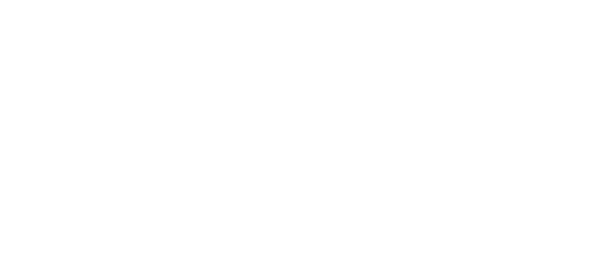
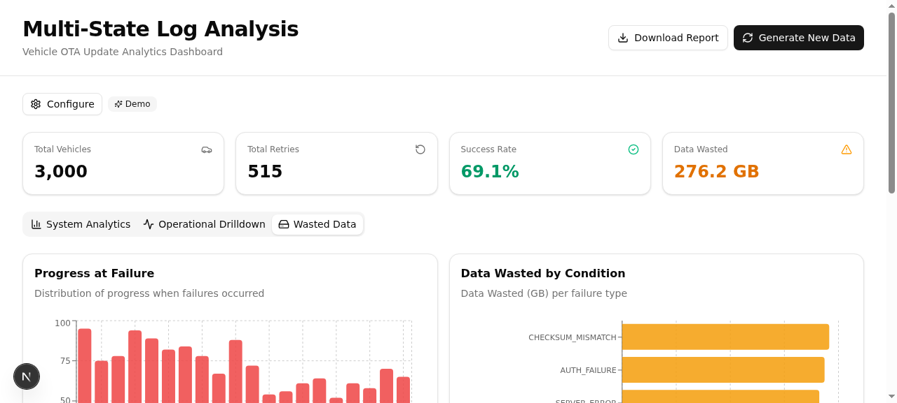
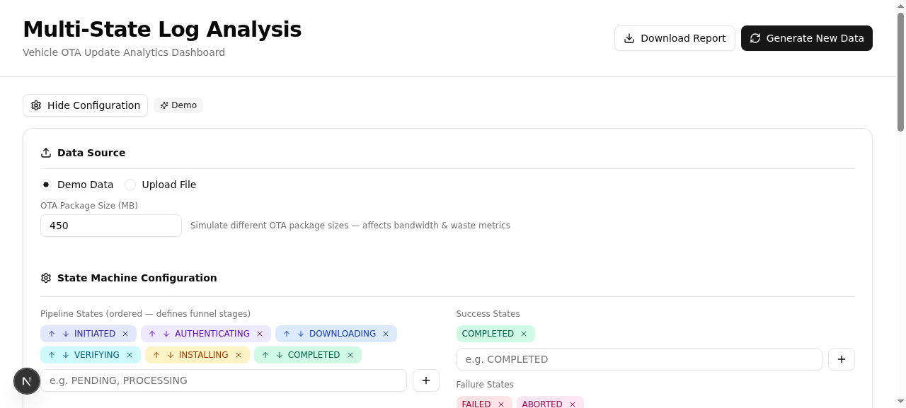

# OTA Analyzer

**Multi-State Log Analysis & Visualization Dashboard** for Vehicle OTA (Over-The-Air) Update Analytics.

[](https://github.com/CJ-1981/ota-analyzer/actions/workflows/deploy.yml)
[](https://cj-1981.github.io/ota-analyzer/)

## Live Demo

**https://cj-1981.github.io/ota-analyzer/**

## Features

- **System Analytics** — Sankey-style state transition flow, funnel visualization, success rate & KPI metrics
- **Operational Drilldown** — Time-series trends, retry distribution, sortable & filterable log entries table
- **Wasted Data Analysis** — Failure progress distribution, wasted bandwidth breakdown by failure condition
- **Configurable OTA Package Size** — Simulate different OTA package sizes and see impact on bandwidth & waste metrics
- **Column Filtering & Sorting** — Free-text search on every table column, click-to-sort with direction indicators
- **Custom Data Upload** — Upload your own CSV/TSV/JSON files with auto-detected column mappings
- **Demo Mode** — 3,000 vehicle OTA update paths with realistic state transitions and failure conditions
- **Report Export** — Download a full PDF report of the current analytics view
- **Static Deployment** — Pre-computed analytics at build time, no backend required

## Screenshots

### Dashboard Overview



KPI cards show total vehicles, retries, success rate, and wasted data. The state transition flow visualizes how vehicles move through the OTA pipeline stages (Initiated → Authenticating → Downloading → Verifying → Installing → Completed).

### Operational Drilldown


Time-series chart tracks events, successes, and failures over time. The log entries table supports per-column text filtering and sortable headers — click any header to sort ascending/descending, type in the filter row to search within any column.

### Wasted Data Analysis



Histogram shows failure progress distribution — where in the download/install process vehicles tend to fail. Bar chart breaks down wasted bandwidth by failure condition (network timeout, disk full, auth failure, etc.).

### Configuration Panel



Easily switch between demo mode and custom data upload. Configure OTA package size, pipeline states, success/failure/retry states, and column mappings. All changes take effect immediately.

## Tech Stack

| Layer | Technology |
|---|---|
| Framework | Next.js 16 (Static Export) |
| Language | TypeScript |
| Styling | Tailwind CSS 4 + shadcn/ui |
| Charts | Recharts |
| Build | Webpack |
| Deployment | GitHub Pages |

## Getting Started

### Prerequisites

- Node.js 18+
- npm

### Installation

```bash
# Clone the repository
git clone https://github.com/CJ-1981/ota-analyzer.git
cd ota-analyzer

# Install dependencies
npm install

# Start development server
npm run dev
```

Open [http://localhost:3000](http://localhost:3000) in your browser.

### Build for Production

```bash
# Build static site (generates sample data + webpack build)
npm run build

# Output is in the `out/` directory
```

### How It Works

1. **Build time** — `npm run prebuild` generates `sample-logs.json` (raw OTA log entries) and `sample-analytics.json` (pre-computed KPIs, charts, sankey data)
2. **Page load** — The browser fetches the pre-computed analytics (68KB) and raw log data (1.3MB) from static JSON files
3. **Client-side** — Analytics are computed from the loaded data for filtering, sorting, and table operations
4. **No backend** — Everything runs in the browser; suitable for GitHub Pages, S3, or any static host

## Project Structure

```
src/
├── app/
│   └── page.tsx            # Main dashboard (single-page app)
├── lib/
│   ├── analytics.ts        # Analytics computation engine
│   ├── data-generator.ts   # Seeded OTA demo data generator
│   ├── data-parser.ts      # CSV/TSV/JSON parser & normalizer
│   └── types.ts            # TypeScript types & default config
└── components/ui/           # shadcn/ui components
scripts/
└── generate-sample-data.mts # Build-time sample data generation
public/
├── sample-analytics.json   # Pre-computed analytics (68KB)
└── sample-logs.json        # Raw OTA log entries (1.3MB)
```

## License

MIT
